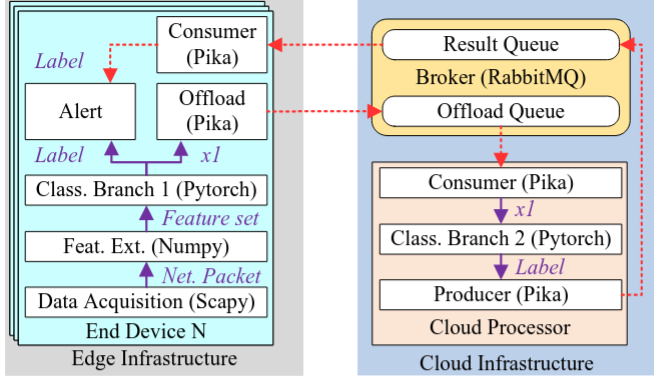
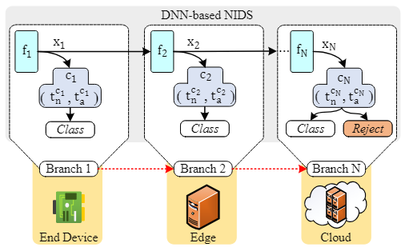

# An Energy-efficient Intrusion Detection Offloading Based on an Early-Exit DNN for Edge-Cloud Computing

This project aims to use Early-Exits Neural Networks with remote offloading of the 
later branches:




## Directory struct review

- `calibration`: functions and scripts to perform Network Calibration
- `dataset`: sample dataset information for testing purposes
- `dnn`: scripts for training the models and perform local inference
- `evaluations`: tools to generate evaluation data to be consumed by other steps
- `figs`: images 
- `models`: DNN models with Early-Exits implementation
- `nsga2`: tools and functions to perform the multi-objective optimization
- `offload`: MQ listener for remote and local inference
- `trained_models`: pre-trained models in pytorch model
- `utils`: common libraries

## Project Setup

Create and setup a new virtual environment

```
python3 -mvenv venv
source venv/bin/activate
```

Install required dependencies

```
pip install -r requirements.txt
```

## Training the early exits models

```
$ dnn/train-early-exit-network.py --help
cuda
usage: train-early-exit-network.py [-h] [--glob GLOB] [--batch_size BATCH_SIZE] [--epochs EPOCHS] --dataset-folder DATASET_FOLDER [--model {alexnet,mobilenet}] [--output-folder OUTPUT_FOLDER]

options:
  -h, --help            show this help message and exit
  --glob GLOB           Glob pattern for dataset - default is 2016_01
  --batch_size BATCH_SIZE
                        Batch size for training - default is 1000
  --epochs EPOCHS       Number of epochs to train for - default is 5
  --dataset-folder DATASET_FOLDER
                        Dataset folder to get the data from
  --model {alexnet,mobilenet}
                        Model to train
  --output-folder OUTPUT_FOLDER
                        Output folder for the model - default is "saves"
```

```
dnn/train-early-exit-network.py --dataset-folder dataset --model mobilenet --epochs 1000 --output-folder /tmp
dnn/train-early-exit-network.py --dataset-folder dataset --model alexnet --epochs 1000 --output-folder /tmp
```

Every epoch results will be saved in the output folder and the most suitable one can be picked.

The trained models used in the paper can be downloaded running:

```
trained_models/download-trained-models.py
```

## Calibration

```
$ calibration/Calibrate2exits.py --help
usage: Calibrate2exits.py [-h] --trained-model TRAINED_MODEL --calibrated-model-savefile CALIBRATED_MODEL_SAVEFILE [--model MODEL] [--savefolder SAVEFOLDER] [--batch-size BATCH_SIZE]
                          [--max-iter MAX_ITER] [--epochs EPOCHS] --dataset DATASET

options:
  -h, --help            show this help message and exit
  --trained-model TRAINED_MODEL
                        .pth file to open
  --calibrated-model-savefile CALIBRATED_MODEL_SAVEFILE
                        .pth file to save
  --model MODEL         Model to choose - [alexnet | mobilenet]
  --batch-size BATCH_SIZE
                        Batch size
  --max-iter MAX_ITER   Max iterations for temperature scaling
  --epochs EPOCHS       Number of epochs for training
  --dataset DATASET     Dataset to use
```

```
calibration/Calibrate2exits.py --model alexnet --trained-model trained_models/AlexNetWithExits.pth \
                               --calibrated-model-savefile AlexNetWithExits_calibrated.pth --dataset dataset/2016_02.csv

calibration/Calibrate2exits.py --model mobilenet --trained-model trained_models/MobileNetV2WithExits.pth \
                               --calibrated-model-savefile MobileNetV2WithExits_calibrated.pth --dataset dataset/2016_02.csv
```


## NSGA2 Operation Point

### Model evaluation

The first step is to generate a csv file with the model evaluation for a sample dataset
in the format:

`y,y_exit_1,cnf_exit_1,bb_time_exit_1,exit_time_exit_1,y_exit_2,cnf_exit_2,bb_time_exit_2,exit_time_exit_2`

```
$ evaluations/generate-model-evaluation-csv.py --help
usage: generate-model-evaluation-csv.py [-h] --trained-model TRAINED_MODEL [--model MODEL] [--batch-size BATCH_SIZE] --dataset DATASET --savefile SAVEFILE

options:
  -h, --help            show this help message and exit
  --trained-model TRAINED_MODEL
                        .pth file to open
  --model MODEL         Model to choose - [alexnet | mobilenet]
  --batch-size BATCH_SIZE
                        Batch size
  --dataset DATASET     Dataset to use
  --savefile SAVEFILE   File to save to
```

```
evaluations/generate-model-evaluation-csv.py --trained-model trained_models/AlexNetWithExits_calibrated.pth --model alexnet \
                                             --dataset dataset/2016_01.csv --savefile evaluations/alexnet/2016_01_eval.csv

evaluations/generate-model-evaluation-csv.py --trained-model trained_models/MobileNetV2WithExits_calibrated.pth --model mobilenet \
                                             --dataset dataset/2016_01.csv --savefile evaluations/mobilenet/2016_01_eval.csv
```

### Multi-objective optimization (NSGA2)

```
$ nsga2/nsga2_2variables.py --help
usage: nsga2_2variables.py [-h] [--min-acceptance MIN_ACCEPTANCE] [--eval-file EVAL_FILE] [--savefile SAVEFILE] [--offspring OFFSPRING] [--gen GEN] [--population POPULATION]

options:
  -h, --help            show this help message and exit
  --min-acceptance MIN_ACCEPTANCE
                        Minimum acceptance rate (default: 0.7)
  --eval-file EVAL_FILE
                        Evaluation file pattern
  --savefile SAVEFILE   Save file name
  --offspring OFFSPRING
                        Number of offsprings (default: 80)
  --gen GEN             Number of generations (default: 1000)
  --population POPULATION
                        Population size (default: 100)
```

```
nsga2/nsga2_2variables.py --eval-file evaluations/mobilenet/2016_01_eval.csv --savefile evaluations/mobilenet/mobilenet_nsga_2016_01.bin
nsga2/nsga2_2variables.py --eval-file evaluations/alexnet/2016_01_eval.csv --savefile evaluations/alexnet/alexnet_nsga_2016_01.bin
```

### Plotting the output (and choosing the operation point)

```
$ nsga2/gen-op-point-chart.py --help
usage: gen-op-point-chart.py [-h] --datafile DATAFILE --savefile SAVEFILE [--operation-point OPERATION_POINT]

options:
  -h, --help            show this help message and exit
  --datafile DATAFILE   Path to the file to load
  --savefile SAVEFILE   Path to the file to save
  --operation-point OPERATION_POINT
                        Operation point coordinates (Array position of options - def: 5)
```

```
nsga2/gen-op-point-chart.py --datafile evaluations/saved/alexnet_x_f_0.9_2016_23.sav \
                            --savefile evaluations/op-point-alexnet.png --operation-point 55
nsga2/gen-op-point-chart.py --datafile evaluations/saved/mobilenet_x_f_0.9_2016_23.sav \
                            --savefile evaluations/op-point-mobilenet.png --operation-point 55
```


```
Quality                                              92.57036
Accuracy                                             0.074244
Time                                                 0.074349
n_1                                                  0.913411
a_1                                                  0.732164
n_2                                                  0.926571
a_2                                                   0.90211
```

Take note of *n_1*, *a_1*, *n_2*, *a_2*.

## Performing an inference

`dnn/inference.py` will perform the inference. A CSV file with the 58 columns is required (the parameters)
from the dataset. The first line is used as header. If a 59th column exists, the header must be named *class*
and the summary of certainty and accuracy are printed

```
$ dnn/inference.py --help
usage: inference.py [-h] --trained-model TRAINED_MODEL [--model MODEL] [--batch-size BATCH_SIZE] --dataset DATASET --savefile SAVEFILE

options:
  -h, --help            show this help message and exit
  --trained-model TRAINED_MODEL
                        .pth file to open
  --model MODEL         Model to choose - [alexnet | mobilenet]
  --batch-size BATCH_SIZE
                        Batch size
  --dataset DATASET     Dataset to use
  --savefile SAVEFILE   File to save to
```
```
dnn/inference.py --trained-model trained_models/AlexNetWithExits_calibrated.pth --model alexnet \
                 --dataset dataset/2016_01.csv --savefile results.csv
dnn/inference.py --trained-model trained_models/MobileNetV2WithExits_calibrated.pth --model mobilenet \
                 --dataset dataset/2016_01.csv --savefile results.csv
```

```
Created with 6 epochs and 50 max iterations.
Exit 1: Accuracy: 0.903, Avg Certainty: 0.863
Exit 2: Accuracy: 0.910, Avg Certainty: 0.891
```

```
$ head results.csv 
exit_1_certainty,exit_1_prediction,exit_2_certainty,exit_2_prediction,class
0.8548224,1,0.936341,1,1
0.9923475,1,0.94304967,1,1
0.9692137,1,0.9627083,1,1
0.9488989,0,0.99486023,0,0
0.80656165,0,0.86406356,0,0
0.8548224,1,0.936341,1,1
0.80656165,0,0.86406356,0,0
0.80656165,0,0.86406356,0,0
0.96779186,1,0.9143728,1,1
```

## Cloud offloading

This system was created with the objective of allowing to offload all or part of the inference
to a remote system. To achieve this, RabbitMQ is used.

### RabbitMQ Setup

RabbitMQ can live anywhere, but usually it'll be installed in the remote (cloud) system

[Installation Instructions](https://www.rabbitmq.com/docs/install-debian)

```
# Install the package
apt install rabbitmq-server

# Create a user named remote with password remote
echo "remote" | rabbitmqctl add_user "remote"

# Give all the permissions to this user
rabbitmqctl set_permissions -p "/" "remote" ".*" ".*" ".*"
```

Take note of the system ip address to connect to it. Make sure security groups are allowing communication
to this instance.

### Remote Consumer Setup

```
$ offload/ee-processor-server.py --help
usage: ee-processor-server.py [-h] [--mq-username MQ_USERNAME] [--mq-password MQ_PASSWORD] --mq-hostname MQ_HOSTNAME [--mq-queue MQ_QUEUE] [--device DEVICE] --trained-network-file TRAINED_NETWORK_FILE
                              --network NETWORK

Early Exits processor server.

options:
  -h, --help            show this help message and exit
  --mq-username MQ_USERNAME
                        RabbitMQ username
  --mq-password MQ_PASSWORD
                        RabbitMQ password
  --mq-hostname MQ_HOSTNAME
                        RabbitMQ hostname
  --mq-queue MQ_QUEUE   RabbitMQ queue
  --device DEVICE       PyTorch device
  --trained-network-file TRAINED_NETWORK_FILE
                        Trainet network file
  --network NETWORK     Network to use AlexNet | MobileNet
```

```
offload/ee-processor-server.py --mq-username remote --mq-password remote --mq-hostname 127.0.0.1 --mq-queue ee-alexnet \
                               --trained-network-file trained_models/AlexNetWithExits_calibrated.pth --network alexnet
```

### Inference with offloading enabled

The `ee-processor-client.py` can be used to perform the inference, offloading exit2 to the cloud
if the certainty threshold is not met. 

```
$ offload/ee-processor-client.py --help
usage: ee-processor-client.py [-h] [--mq-username MQ_USERNAME] [--mq-password MQ_PASSWORD] --mq-hostname MQ_HOSTNAME [--mq-queue MQ_QUEUE] [--device DEVICE] --trained-network-file TRAINED_NETWORK_FILE
                              --network NETWORK --dataset DATASET [--batch-size BATCH_SIZE] [--normal-exit1-min-certainty NORMAL_EXIT1_MIN_CERTAINTY] [--attack-exit1-min-certainty ATTACK_EXIT1_MIN_CERTAINTY]
                              [--normal-exit2-min-certainty NORMAL_EXIT2_MIN_CERTAINTY] [--attack-exit2-min-certainty ATTACK_EXIT2_MIN_CERTAINTY] [--savefile SAVEFILE] [--debug]

Early Exits processor client.

options:
  -h, --help            show this help message and exit
  --mq-username MQ_USERNAME
                        RabbitMQ username
  --mq-password MQ_PASSWORD
                        RabbitMQ password
  --mq-hostname MQ_HOSTNAME
                        RabbitMQ hostname
  --mq-queue MQ_QUEUE   RabbitMQ queue
  --device DEVICE       PyTorch device
  --trained-network-file TRAINED_NETWORK_FILE
                        Trainet network file
  --network NETWORK     Network to use AlexNet | MobileNet
  --dataset DATASET     Dataset to use
  --batch-size BATCH_SIZE
                        Batch size
  --normal-exit1-min-certainty NORMAL_EXIT1_MIN_CERTAINTY
                        Minimum certainty for normal exit 1
  --attack-exit1-min-certainty ATTACK_EXIT1_MIN_CERTAINTY
                        Minimum certainty for attack exit 1
  --normal-exit2-min-certainty NORMAL_EXIT2_MIN_CERTAINTY
                        Minimum certainty for normal exit 2
  --attack-exit2-min-certainty ATTACK_EXIT2_MIN_CERTAINTY
                        Minimum certainty for attack exit 2
  --savefile SAVEFILE   File to save to
  --debug               Enable debug messages
```

Using the values acquired from the NSGA2 sections, here is an usage sample:

```
offload/ee-processor-client.py --mq-username remote --mq-password remote --mq-hostname 127.0.0.1 \
                               --mq-queue ee-alexnet --trained-network-file trained_models/AlexNetWithExits_calibrated.pth \
                               --network alexnet --dataset dataset/2016_01.csv --normal-exit1-min-certainty 0.913411 \
                               --attack-exit1-min-certainty 0.732164 --normal-exit2-min-certainty 0.926571 \
                               --attack-exit2-min-certainty 0.90211 --savefile results.csv
```

```
[1000 rows x 7 columns]                                                                                                                                                                                            
WARNING:  [x] Requesting 2024-08-15 23:51:18.464281 76 being offloaded                                                                                                                                            
Rejection: 6.30%                                                                                                                                                                                                   
Accuracy: 90.07%                                                                                                                                                                                                   
     exit_1_prediction  exit_1_certainty exit_2_prediction exit_2_certainty final_certainty final_prediction  class                                                                                                
0                    1          0.852611               N/A              N/A        0.852611                1      1                                                                                                
1                    0          0.991237               N/A              N/A        0.991237                0      0                                                                                                
2                    1          0.978399               N/A              N/A        0.978399                1      1                                                                                                
3                    1          0.852611               N/A              N/A        0.852611                1      1
4                    1          0.853112               N/A              N/A        0.853112                1      1
..                 ...               ...               ...              ...             ...              ...    ...
995                  1          0.941212               N/A              N/A        0.941212                1      1
996                  1          0.852611               N/A              N/A        0.852611                1      1
997                  1          0.992592               N/A              N/A        0.992592                1      1
998                  0          0.511411                 1         0.884535        rejected         rejected      1
999                  0          0.915787               N/A              N/A        0.915787                0      0

[1000 rows x 7 columns]
Rejection total: 5.32%
Accuracy total: 91.13%
Offloaded total: 6.42%
```
